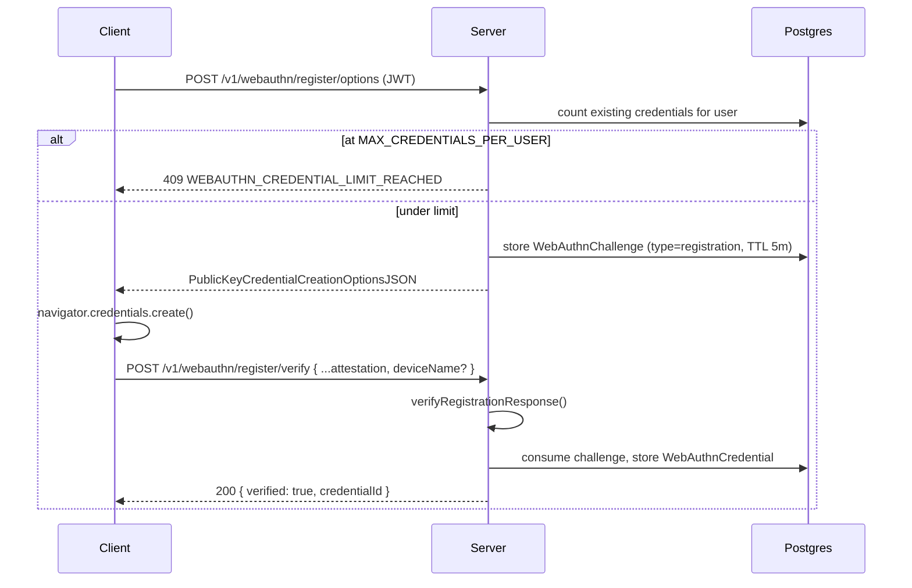
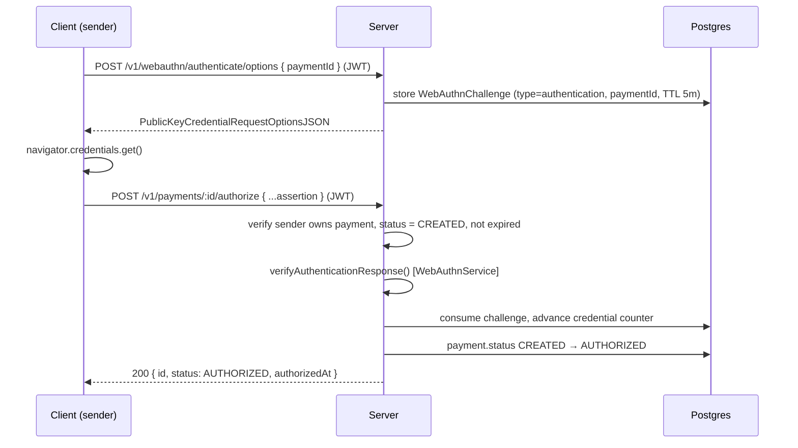

# Architecture — Hybrid Auth (Supabase + WebAuthn)

> Server-side reference for how Ding Payments authenticates a *session* and
> authorizes a *payment*. Covers SRV-041–048 (S10/S11). For the full system
> design, data model, and API surface, see [server-build-plan.md](./server-build-plan.md).

## 1. Why two auth mechanisms

Ding is self-custodial: the server never holds a user's Stellar private key.
It still needs to be sure that (a) a request comes from a logged-in user, and
(b) a *payment* is being approved by the physical owner of that user's phone,
not just anyone with a valid session token. One mechanism handles each job:

| Layer | Mechanism | Answers | Scope |
|-------|-----------|---------|-------|
| Session | Supabase JWT | "Is this a logged-in user?" | Every request (except `@Public()` routes) |
| Payment approval | WebAuthn (passkey) | "Did the device owner just approve *this* payment?" | Only `POST /v1/payments/:id/authorize` |

A stolen or replayed JWT is enough to *read* data, but never enough to move
funds — that always requires a fresh, payment-scoped passkey assertion.

## 2. Session layer — Supabase JWT

- `SupabaseAuthGuard` is registered globally (`APP_GUARD` in `app.module.ts`);
  every route is protected unless annotated `@Public()`.
- The guard validates the bearer token against `SUPABASE_JWT_SECRET` and
  attaches `{ supabaseUserId, email }` to `request.user`, retrievable with the
  `@CurrentUser()` decorator.
- Each protected service resolves the *internal* Ding user from
  `authUser.supabaseUserId` via `UsersService.getUserBySupabaseId()` — the
  Supabase ID is never used directly as a foreign key elsewhere.
- `@Public()` routes: `POST /v1/payment-requests/validate`, `GET /health*`.

This layer alone is what the client uses for every non-payment call (fetch
profile, list transactions, validate an NFC payload).

## 3. Payment-approval layer — WebAuthn

### 3.1 Registering a passkey (once per device)

### 3.2 Authorizing a payment (every payment)

The challenge for step 3.2 is bound to a specific `paymentId`
(`WebAuthnChallenge.paymentId`), so an assertion generated for one payment
cannot be replayed against another.

### 3.3 Guards enforced before verification (`PaymentsService.authorize`)

| Check | Failure | HTTP |
|-------|---------|------|
| Payment exists | `PAYMENT_NOT_FOUND` | 404 |
| Caller is the payment's sender | `FORBIDDEN` | 403 |
| Payment status is `CREATED` | `PAYMENT_INVALID_STATE` | 409 |
| Payment not expired | `PAYMENT_INVALID_STATE` | 409 |
| WebAuthn assertion valid | `WEBAUTHN_VERIFICATION_FAILED` / `WEBAUTHN_CHALLENGE_EXPIRED` | 400 |

Only after all five pass does the payment transition to `AUTHORIZED` and emit
`payment.authorized`.

## 4. Per-device credentials policy (SRV-046)

A passkey is the only thing standing between a valid session and moving
funds — there is no password fallback. Two rules follow directly from that:

1. **Bounded enrolment.** A user may register at most `MAX_CREDENTIALS_PER_USER`
   (5) passkeys. Registering past the limit is rejected at the
   `register/options` step with `409 WEBAUTHN_CREDENTIAL_LIMIT_REACHED`,
   before any authenticator ceremony starts. This keeps the
   `allowCredentials` list sent to authenticators small and bounds the impact
   of a single compromised or lost device.
2. **Never zero.** A user may never revoke their last remaining passkey.
   `DELETE /v1/webauthn/credentials/:id` rejects with
   `409 WEBAUTHN_LAST_CREDENTIAL` when the target is the user's only
   credential — doing otherwise would permanently lock them out of
   authorizing payments.

Both limits are kept as source constants (`webauthn.constants.ts`) rather
than env vars, consistent with `CHALLENGE_TTL_MS` — they are security
invariants, not per-environment tuning knobs.

### 4.1 Device management endpoints

| Method | Route | Auth | Description |
|--------|-------|------|-------------|
| `POST` | `/v1/webauthn/register/options` | JWT | Start registration; 409 at the cap |
| `POST` | `/v1/webauthn/register/verify` | JWT | Complete registration; optional `deviceName` |
| `GET` | `/v1/webauthn/credentials` | JWT | List the caller's registered passkeys |
| `DELETE` | `/v1/webauthn/credentials/:id` | JWT | Revoke a passkey; 409 if it's the last one |
| `POST` | `/v1/webauthn/authenticate/options` | JWT | Start a payment-scoped authentication challenge |
| `POST` | `/v1/payments/:id/authorize` | JWT | Verify assertion, transition `CREATED → AUTHORIZED` |

`GET /v1/webauthn/credentials` never returns `credentialId` or the raw public
key — only `{ id, deviceName, createdAt, lastUsedAt }`, where `id` is the
internal record ID used for revocation. This keeps the device-management UI
free of any value that could be replayed in an authentication ceremony.

## 5. Anti-clone protection

Every `WebAuthnCredential` stores a `counter` (from the authenticator). On
each successful payment authorization the server updates it to
`authenticationInfo.newCounter` and stamps `lastUsedAt`. `verifyAuthenticationResponse`
rejects an assertion whose counter does not strictly increase, which is the
standard signal a credential has been cloned (two authenticators
independently incrementing the same counter will diverge). This makes
`lastUsedAt` a genuine "this device was last used to approve a payment on
{date}" signal in the device-management list, not just a login timestamp.

## 6. Error codes (WebAuthn scope)

| Code | HTTP | Meaning |
|------|------|---------|
| `WEBAUTHN_VERIFICATION_FAILED` | 400 | Attestation/assertion failed cryptographic verification, or referenced an unknown/foreign credential |
| `WEBAUTHN_CHALLENGE_EXPIRED` | 400 | No matching, unexpired challenge for this user (and payment, for authentication) |
| `WEBAUTHN_CREDENTIAL_EXISTS` | 409 | Duplicate `credentialId` on registration (Prisma `P2002`) |
| `WEBAUTHN_NO_CREDENTIALS` | 400 | User has no registered passkeys — cannot authenticate |
| `WEBAUTHN_CREDENTIAL_LIMIT_REACHED` | 409 | User is at `MAX_CREDENTIALS_PER_USER` |
| `WEBAUTHN_CREDENTIAL_NOT_FOUND` | 404 | Revocation target doesn't exist or isn't owned by the caller |
| `WEBAUTHN_LAST_CREDENTIAL` | 409 | Attempted to revoke the user's only remaining passkey |

All error bodies follow the global envelope from `HttpExceptionFilter`:
`{ statusCode, message, code, errors, timestamp, path }`.

## 7. Configuration

| Variable | Required | Notes |
|----------|----------|-------|
| `WEBAUTHN_RP_ID` | Yes | Relying Party ID (domain), must match the client origin's host |
| `WEBAUTHN_RP_NAME` | Yes | Human-readable RP name shown by the authenticator UI |
| `WEBAUTHN_ORIGIN` | Yes | Full expected origin (scheme + host [+ port]) |

`CHALLENGE_TTL_MS` (5 minutes) and `MAX_CREDENTIALS_PER_USER` (5) are code
constants in `src/webauthn/webauthn.constants.ts`, not environment variables
— see §4.

## 8. Testing strategy

- **Unit** (`src/webauthn/webauthn.service.spec.ts`): mocks
  `@simplewebauthn/server` and `WebAuthnRepository`; covers registration
  (incl. the credential cap and `deviceName` persistence), authentication
  options, payment-assertion verification (incl. an assertion presented for a
  *different* user's credential), and device management
  (`listCredentials`, `revokeCredential`, including the "last credential"
  guard).
- **E2E** (`test/webauthn-payments.e2e-spec.ts`): boots the real `AppModule`
  with `PrismaService` and `WebAuthnService` mocked, and a real Supabase JWT
  signed with the test secret — so the actual `SupabaseAuthGuard`, DTO
  validation (`whitelist` + `forbidNonWhitelisted`), and HTTP status/error
  mapping run unmodified. Exercises the full device-management surface and
  the `payments/:id/authorize` state guards.
- The real WebAuthn ceremony (browser ↔ authenticator) is out of scope for
  automated tests here; `@simplewebauthn/server`'s own test suite covers the
  cryptographic verification logic that Ding depends on.
