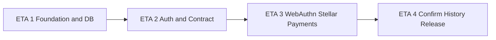

# Ding Payments — Server Build Plan (Consolidated)

> **Executive backlog for `ding-server/`** — 20 deliverables across 4 stages.
>
> Version: 1.1 · Date: 2026-06-17 · Scope: server MVP
>
> **Companion document:** [server-build-plan.md](./server-build-plan.md) — atomic spec (106 `SRV-###` tasks). Use this consolidated plan for sprints and GitHub Issues; use the atomic plan for implementation detail per sub-task.

**Required references:**

- [ding-payments.md](./ding-payments.md) — product vision and UX flows
- [payment-request.v1.md](./payment-request.v1.md) — canonical NFC contract
- Client consolidated plan: `ding-payments/docs/build-plan-client-consolidated.md`

---

## How to use this document

1. Execute **ETA 1 → ETA 4** in order; respect `Depends on`.
2. Each deliverable (`S##`) is one **sprint-sized** ticket (~1–2 weeks); atomic `SRV-###` IDs are a checklist inside the ticket.
3. For files, steps, tests and acceptance criteria per atomic task, open [server-build-plan.md](./server-build-plan.md) and search the `SRV-###` heading.
4. Target: **1 deliverable per 2-week sprint** ≈ 20 sprints to MVP release.

### Field legend

| Field | Meaning |
|-------|---------|
| ETA | Macro stage (1–4), 5 deliverables each |
| Priority | P0 = MVP blocker, P1 = release quality, P2 = nice-to-have |
| Complexity | E = Easy, M = Medium, H = Hard (multi-day / multi-area) |
| Atomic tasks | Original `SRV-###` IDs merged into this deliverable |

### Stage flow



---

## Task summary table

| ID | Title | ETA | P | C | Depends on | Atomic tasks |
|----|-------|-----|---|---|------------|--------------|
| S01 | Project bootstrap: README, env and dependencies | 1 | P0 | E | — | SRV-001, SRV-002, SRV-003 |
| S02 | Application core: config, main.ts and error handling | 1 | P0 | M | S01 | SRV-004, SRV-005, SRV-006 |
| S03 | Codebase structure and developer tooling | 1 | P0 | E | — | SRV-007, SRV-008 |
| S04 | Prisma setup, core schema and initial migration | 1 | P0 | M | S01, S02, S03 | SRV-009, SRV-010, SRV-011, SRV-012 |
| S05 | Extended schema, indexes, seed and DB documentation | 1 | P0/P1 | M | S04 | SRV-013–SRV-020 |
| S06 | Supabase authentication module and JWT strategy | 2 | P0 | M | S02 | SRV-021, SRV-022, SRV-023, SRV-024, SRV-025 |
| S07 | Users API, wallet linking and auth test suite | 2 | P0 | M | S04, S06 | SRV-026, SRV-027, SRV-028, SRV-029, SRV-030 |
| S08 | payment-request.v1 contract restore and validation core | 2 | P0 | M | S03 | SRV-031, SRV-032, SRV-033, SRV-034, SRV-035 |
| S09 | Payment requests API: Swagger, E2E, persist and retrieve | 2 | P0 | M | S05, S08, S06 | SRV-036, SRV-037, SRV-038, SRV-039, SRV-040 |
| S10 | WebAuthn module and payment authorization | 2 | P0 | H | S05, S09 | SRV-041, SRV-042, SRV-043, SRV-044, SRV-045 |
| S11 | WebAuthn hardening, tests and hybrid auth documentation | 3 | P0/P1 | M | S10 | SRV-046, SRV-047, SRV-048 |
| S12 | Stellar module: config, assets and transaction pipeline | 3 | P0 | H | S02 | SRV-049, SRV-050, SRV-051, SRV-052, SRV-053, SRV-054, SRV-055 |
| S13 | Stellar API surface: simulate, XDR validation and health | 3 | P0 | H | S12 | SRV-056, SRV-057, SRV-058, SRV-059, SRV-060 |
| S14 | Payment lifecycle: create, authorize and submit relay | 3 | P0 | H | S10, S12, S13, S09 | SRV-061, SRV-062, SRV-063, SRV-064, SRV-065, SRV-066 |
| S15 | Payment confirmation polling and failure handling | 3 | P0 | M | S14 | SRV-067, SRV-068, SRV-069, SRV-070, SRV-071, SRV-072 |
| S16 | Payment E2E, Swagger module and history API core | 4 | P0/P1 | H | S02, S15, S05 | SRV-073, SRV-074, SRV-075, SRV-076 |
| S17 | History reconciliation, DTOs and query optimization | 4 | P1/P2 | M | S16, S05 | SRV-077, SRV-078, SRV-079, SRV-080 |
| S18 | Security hardening: rate limits, validation and replay protection | 4 | P0 | H | S01, S08, S05, S13 | SRV-081, SRV-082, SRV-083, SRV-084, SRV-085, SRV-086, SRV-087, SRV-088 |
| S19 | Operational security, logging and quality gates | 4 | P0/P1 | M | S05, S02, S16 | SRV-089, SRV-090, SRV-091, SRV-092, SRV-093, SRV-094, SRV-095, SRV-096, SRV-097, SRV-099 |
| S20 | CI/CD, load testing, deploy and MVP release | 4 | P0/P1 | H | S19, S18, S16 | SRV-098, SRV-100, SRV-101, SRV-102, SRV-103, SRV-104, SRV-105, SRV-106 |

---

## ETA 1 — Foundation and database (5 deliverables)

NestJS bootstrap and complete Prisma schema. **Milestone: migrated database with all MVP models.**

### S01 — Project bootstrap: README, env and dependencies

| Atomic | SRV-001, SRV-002, SRV-003 | Depends on | — | Complexity | Easy |

**Done when:** Ding Payments README; `.env.example`; core NestJS dependencies installed.

---

### S02 — Application core: config, main.ts and error handling

| Atomic | SRV-004, SRV-005, SRV-006 | Depends on | S01 | Complexity | Medium |

**Done when:** Validated env; production `main.ts` (Swagger, versioning); global exception filter with `{ error: { code, message } }`.

---

### S03 — Codebase structure and developer tooling

| Atomic | SRV-007, SRV-008 | Depends on | — | Complexity | Easy |

**Done when:** Flat `src/` module layout; `.cursor/rules` updated for ding-server.

---

### S04 — Prisma setup, core schema and initial migration

| Atomic | SRV-009, SRV-010, SRV-011, SRV-012 | Depends on | S01, S02, S03 | Complexity | Medium |

**Done when:** Prisma scripts + CI generate; `User`/`Wallet` schema; `DatabaseModule`; first migration applied.

---

### S05 — Extended schema, indexes, seed and DB documentation

| Atomic | SRV-013–SRV-020 | Depends on | S04 | Complexity | Medium |

**Includes:** PaymentRequest, Payment, Transaction, WebAuthn, UsedRequestId models; indexes; optional RLS; dev seed; Supabase docs; Prisma transaction patterns doc.

**Done when:** Full domain schema migrated; `prisma db seed` works; DB documented in README.

---

## ETA 2 — Auth and payment-request contract (5 deliverables)

Supabase JWT, users API, and NFC validation surface. **Milestone: client can validate and persist payment requests.**

### S06 — Supabase authentication module and JWT strategy

| Atomic | SRV-021–SRV-025 | Depends on | S02 | Complexity | Medium |

**Includes:** SupabaseModule, JWT Passport strategy, global auth guard, `@Public()`, `@CurrentUser()`, UsersModule sync on first login.

**Done when:** Protected routes require valid Supabase JWT; user row created on first request.

---

### S07 — Users API, wallet linking and auth test suite

| Atomic | SRV-026–SRV-030 | Depends on | S04, S06 | Complexity | Medium |

**Includes:** `GET /v1/users/me`, wallet pubkey link, Stellar `G...` validation, unit tests, E2E with JWT mock.

**Done when:** User profile and wallet endpoints work; auth test suite green.

---

### S08 — payment-request.v1 contract restore and validation core

| Atomic | SRV-031–SRV-035 | Depends on | S03 | Complexity | Medium |

**Includes:** Restore `docs/payment-request.v1.md`; port TypeScript contract; unit tests; PaymentRequestsModule; `POST /v1/payment-requests/validate`.

**Done when:** Validate endpoint returns normalized payload or structured `PAYMENT_REQUEST_*` errors.

---

### S09 — Payment requests API: Swagger, E2E, persist and retrieve

| Atomic | SRV-036–SRV-040 | Depends on | S05, S08, S06 | Complexity | Medium |

**Includes:** OpenAPI for validate; E2E valid/invalid Stellar cases; persist receiver request; anti-replay `requestId`; `GET /v1/payment-requests/:id`.

**Done when:** Full payment-request CRUD surface documented and tested.

---

### S10 — WebAuthn module and payment authorization

| Atomic | SRV-041–SRV-045 | Depends on | S05, S09 | Complexity | Hard |

**Includes:** `@simplewebauthn/server`; challenge store; register/authenticate endpoints; `POST /v1/payments/:id/authorize`.

**Done when:** Payment moves to AUTHORIZED via WebAuthn assertion.

---

## ETA 3 — WebAuthn, Stellar and payment pipeline (5 deliverables)

Stellar relay and payment state machine through on-chain submit. **Milestone: signed XDR broadcast with polling started.**

### S11 — WebAuthn hardening, tests and hybrid auth documentation

| Atomic | SRV-046–SRV-048 | Depends on | S10 | Complexity | Medium |

**Done when:** Per-device credential policy; mocked WebAuthn tests; hybrid Supabase+WebAuthn documented in ARCHITECTURE.

---

### S12 — Stellar module: config, assets and transaction pipeline

| Atomic | SRV-049–SRV-055 | Depends on | S02 | Complexity | Hard |

**Includes:** StellarModule, network config, getAccount, XLM/USDC assets, build unsigned tx, simulate, submit XDR, poll status.

**Done when:** StellarService can build, simulate, submit and poll transactions.

---

### S13 — Stellar API surface: simulate, XDR validation and health

| Atomic | SRV-056–SRV-060 | Depends on | S12 | Complexity | Hard |

**Includes:** `POST /v1/transactions/simulate`; strict XDR vs payment intent validation; Horizon error mapping; `/health/stellar`; SDK mocks tests.

**Done when:** Public simulate API works; malicious XDR rejected; Stellar health check live.

---

### S14 — Payment lifecycle: create, authorize and submit relay

| Atomic | SRV-061–SRV-066 | Depends on | S10, S12, S13, S09 | Complexity | Hard | **Critical path**

**Includes:** PaymentsModule, state machine, create intent, sender≠receiver checks, CREATED→AUTHORIZED, submit relay XDR, AUTHORIZED→SUBMITTED.

**Done when:** Client can create payment, authorize, and submit signed XDR for broadcast.

---

### S15 — Payment confirmation polling and failure handling

| Atomic | SRV-067–SRV-072 | Depends on | S14 | Complexity | Medium |

**Includes:** Event-driven polling; SUBMITTED→CONFIRMED/FAILED; `GET /v1/payments/:id`; Transaction indexing; idempotent submit; auth timeout→FAILED.

**Done when:** Payment reaches terminal state; status endpoint returns full lifecycle.

---

## ETA 4 — History, security and release (5 deliverables)

History API, hardening, observability, deploy. **Milestone: server deployable to staging with release checklist.**

### S16 — Payment E2E, Swagger module and history API core

| Atomic | SRV-073, SRV-074, SRV-075, SRV-076 | Depends on | S02, S15, S05 | Complexity | Hard |

**Includes:** Full payment E2E with mock Stellar; complete payments Swagger; `GET /v1/transactions` with filters.

**Done when:** E2E payment flow passes in test suite; history list endpoint works.

---

### S17 — History reconciliation, DTOs and query optimization

| Atomic | SRV-077–SRV-080 | Depends on | S16, S05 | Complexity | Medium |

**Includes:** Optional Horizon reconciliation; response DTOs with explorer links; history indexes; list/filter tests.

**Done when:** History queries optimized; DTOs complete; tests pass.

---

### S18 — Security hardening: rate limits, validation and replay protection

| Atomic | SRV-081–SRV-088 | Depends on | S01, S08, S05, S13 | Complexity | Hard |

**Includes:** ThrottlerModule; 5 min clock skew; 30s NFC expiry; output sanitization; AuditLog; CORS per env; `X-Request-Id`; wallet JWT matches XDR signer.

**Done when:** Security controls active on payment-critical endpoints.

---

### S19 — Operational security, logging and quality gates

| Atomic | SRV-089–SRV-097, SRV-099 | Depends on | S05, S02, S16 | Complexity | Medium |

**Includes:** `stellarTxHash` uniqueness; security checklist; structured logging; `/health` readiness; metrics endpoint; full Swagger; ARCHITECTURE.md + API.md; 80% coverage; contract tests.

**Done when:** Observability and documentation complete; coverage target met on critical modules.

---

### S20 — CI/CD, load testing, deploy and MVP release

| Atomic | SRV-098, SRV-100, SRV-101–SRV-106 | Depends on | S19, S18, S16 | Complexity | Hard |

**Includes:** E2E suite in CI; basic load test on validate; multi-stage Dockerfile; docker-compose dev; staging deploy; `prisma migrate deploy` in CI/CD; Stellar down runbook; MVP release checklist.

**Done when:** Server deploys to staging; release checklist signed off.

---

## Hard blockers

| Deliverable | Why |
|-------------|-----|
| **S04** | No domain features without migrations |
| **S06** | Auth guard blocks all protected endpoints |
| **S08** | NFC contract must match client before validate API |
| **S14** | Submit relay is core server responsibility |
| **S16** | E2E proof before release |

---

## Client ↔ server alignment

| Server | Client | Integration |
|--------|--------|-------------|
| S08, S09 | C10, C11 | `payment-request.v1` validation |
| S10, S14 | C13 | WebAuthn authorize + submit |
| S15, S16 | C13, C16 | `GET /v1/payments/:id` polling |
| S06, S07 | C16 | User profile and wallet register |
| S16 | C18 | Full E2E payment matrix |

---

## Payment state machine (reference)

```
CREATED → AUTHORIZED → SUBMITTED → CONFIRMED
                              ↘ FAILED
```

Implemented across: **S14** (create, authorize, submit), **S15** (confirm/fail/timeout).

---

## Sprint planning guide

| Sprint | Deliverable | Milestone |
|--------|-------------|-----------|
| 1 | S01 | Repo bootstrapped |
| 2 | S02–S03 | Server boots |
| 3 | S04 | Core DB migrated |
| 4 | S05 | Full schema |
| 5 | S06 | Auth module |
| 6 | S07 | Users API |
| 7 | S08 | NFC contract |
| 8 | S09 | Validate API |
| 9 | S10 | WebAuthn authorize |
| 10 | S11 | WebAuthn hardened |
| 11 | S12 | Stellar pipeline |
| 12 | S13 | Stellar API |
| 13 | S14 | Submit relay |
| 14 | S15 | Confirmation |
| 15 | S16 | **E2E payment** |
| 16 | S17 | History |
| 17 | S18 | Security |
| 18 | S19 | Observability |
| 19–20 | S20 | Staging deploy |

---

*Consolidated from 106 atomic tasks (v1.1: 20 deliverables). Detail: [server-build-plan.md](./server-build-plan.md)*
